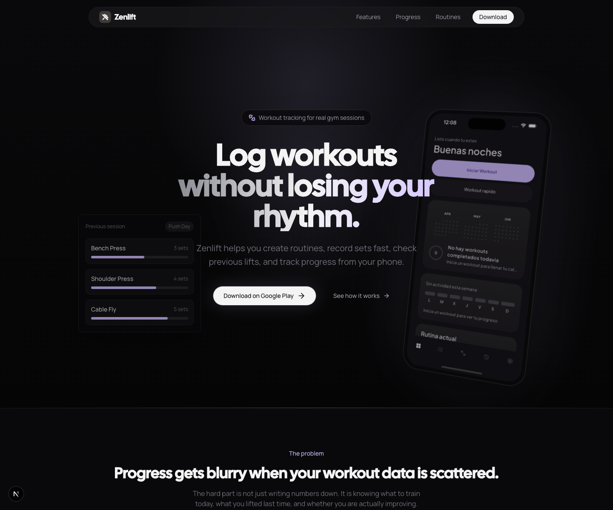
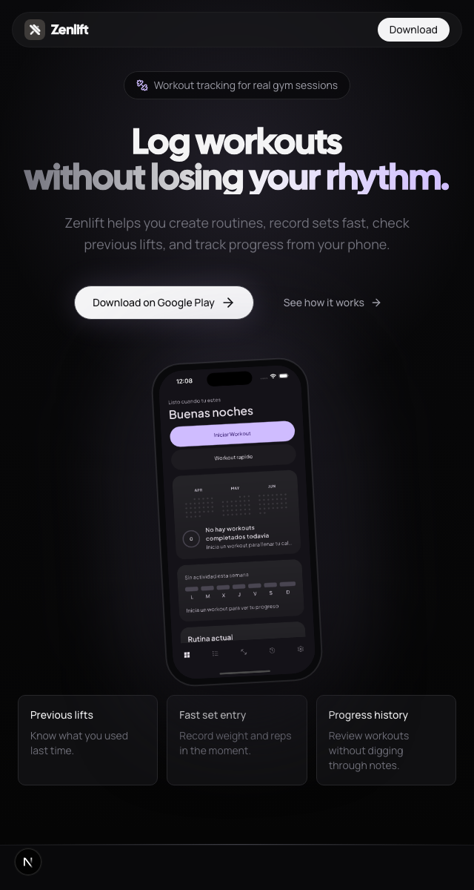
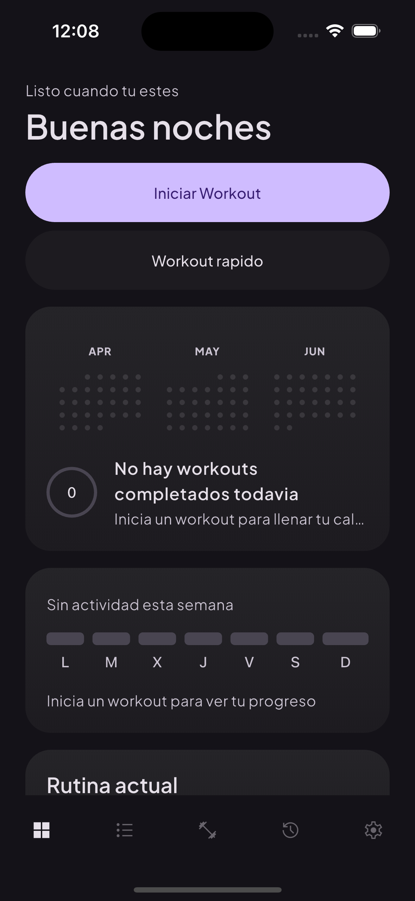

# Zenlift Landing Page

Zenlift Landing Page is a responsive product website for Zenlift, a Flutter workout tracking app built for real gym sessions. The site introduces the product, highlights the training workflow, and provides legal pages needed for a mobile app launch.

## Preview

### Desktop Web



### Mobile Web



### Product Screen



## About Zenlift

Zenlift helps gym users create routines, log sets quickly, review previous lifts, and track progress from their phone. This repository contains the marketing landing page for the app, with a focus on clear product messaging, responsive presentation, and launch-ready supporting pages.

## Highlights

- Built with the Next.js App Router and React Server Components where appropriate.
- Responsive dark interface with a focused visual system for a fitness product.
- Real app screenshot integration inside the landing-page hero.
- Dedicated privacy policy and account deletion routes for app distribution requirements.
- Developed with an OpenSpec workflow so product requirements, implementation changes, and specs stay traceable.

## Tech Stack

- **Framework:** Next.js App Router
- **Language:** TypeScript
- **UI:** React, shadcn/ui, Lucide React
- **Styling:** Tailwind CSS v4 with CSS-first theme variables
- **Motion:** Framer Motion and Lenis smooth scrolling
- **Analytics:** Vercel Analytics
- **Deployment:** Vercel

## Development Process

This project was developed using OpenSpec. Canonical requirements live in `openspec/specs/`, while active and archived change artifacts live in `openspec/changes/`. This keeps product decisions, acceptance criteria, and implementation work connected across the project lifecycle.

## Getting Started

Install dependencies:

```bash
pnpm install
```

Start the development server:

```bash
pnpm dev
```

Run linting:

```bash
pnpm lint
```

Create a production build:

```bash
pnpm build
```

## Project Structure

```text
app/                    Next.js routes and global styles
components/sections/    Landing-page sections
components/ui/          shadcn/ui components and shared UI primitives
components/providers/   Client-side providers
lib/                    Shared utilities
openspec/               Specs, proposals, and change workflow artifacts
public/                 Brand assets, app screenshots, and README previews
```

## Deployment

The project is configured for Vercel deployment. Build the app with `pnpm build`, then deploy through Vercel using the standard Next.js preset.
